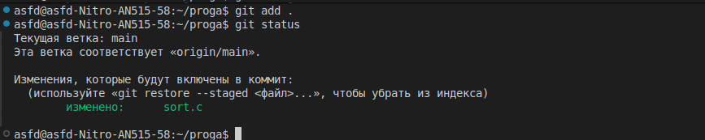
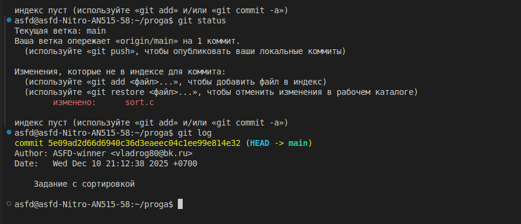
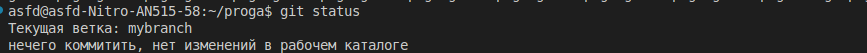
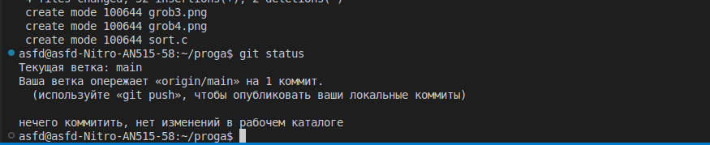

# Выполняем 1 пункт 

# Выполняем 2 пункт

# Выполняем 3 пункт вместе с 4

# Делаем 5 пункт add и 6 пункт

# Делаем 7 и 8 пункты git status после коммита

# Делаем 9 и 10 пункты git status после комментария

# Делаем 11 и 12 пункты git status после add

# Делаем 13 и 14 и 15 пункты еще комментарии и commit

# Делаем 16 и 17 пункты еще коммитим и пушим

# Делаем первые три пункта и 5 пункт второй части

# Делаем 4 пункт сравнение git status

