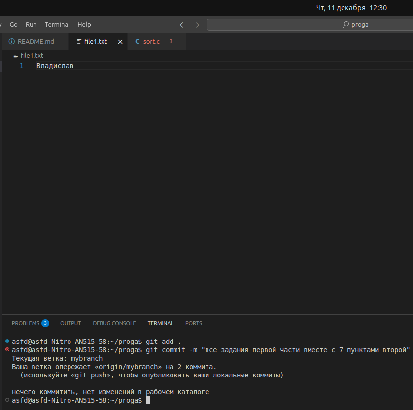
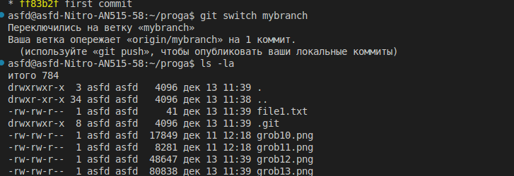
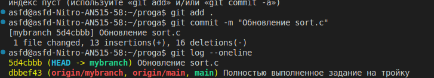
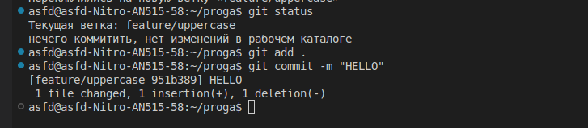
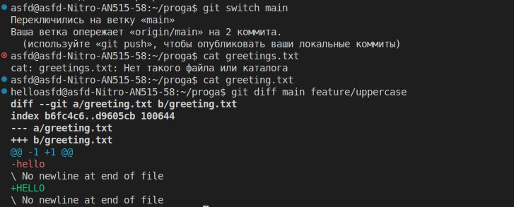
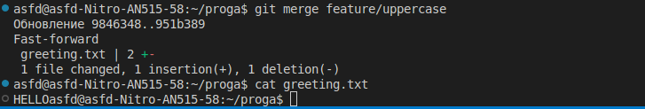

# Выполняем 1 пункт 

# Выполняем 2 пункт

# Выполняем 3 пункт вместе с 4

# Делаем 5 пункт add и 6 пункт

# Делаем 7 и 8 пункты git status после коммита

# Делаем 9 и 10 пункты git status после комментария

# Делаем 11 и 12 пункты git status после add

# Делаем 13 и 14 и 15 пункты еще комментарии и commit

# Делаем 16 и 17 пункты еще коммитим и пушим

# Делаем первые три пункта и 5 пункт второй части

# Делаем 4 пункт сравнение git status

# Делаем 6 и 7 пункт создавая file1.txt и commit

# Делаем 8 и 9 пункт используя git log --oneline --graph и переходим обратно в master ветку

# Делаем 10 пункт используя git log --oneline  и смотрим разницу на разных ветках

# Разница в том, что коммит из ветки mybranch не будет виден на ветки main

# Делаем 11 и 12 пункт создавая file2 коммитим его и используем gitlog

# Делаем 13 и 14 пункт переходим на ветку mybranch и проверяем исчезновение file2

# Делаем 15 пункт используя git diff mybranch master

# ///////Начало заданий на 4\\\\\\\

# Делаем первые три пункта переходя на ветку меняя файл и прописывая git diff

# Делаем 4 пункт git diff --staged

# Делаем 5 и 6 и 7 пункты git diff и add

# Делаем 8 и 9 и 10 пункты git diff и удаление числа

# Обьяснение 11 пункта: У нас не показали изменения в staged потому что мы не написали git add переведя их в staged
# Делаем 12 пункт git status

# Делаем 13 и 14 пункты git status и git restore --staged

# Делаем 15 и 16 пункты add, commit и журнал

# Делаем 17 и 18 пункты printf и cat

# Делаем 19 и 20 и 21 пункты git status, git restore и cat

# Делаем 22 пункт git status

# Вторая часть

# Делаем 1 пункт создавая файл greeting.txt и add, commit

# Делаем 2 и 3 и 4 пункты добавляя в файл greeting.txt и add, commit и создаем и переключаемся на ветку feature/uppercase

# Делаем 5, 6 и 7 пункты git status редактирование greeting.txt и add c  commit

# Делаем 8 пункт git branch

# Делаем 9 пункт git log --oneline --graph –all

# Делаем 10 и 11 и 12 пункты переключаемся на главную ветку и сравниваем

# Делаем 13 и 14 пункты git merge и cat

# Делаем 15 и 16 и 17 пункты git merge и git log --oneline --graph –all и удаляем ветку
