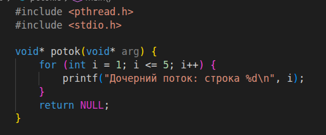
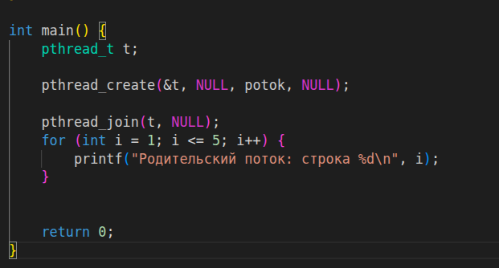
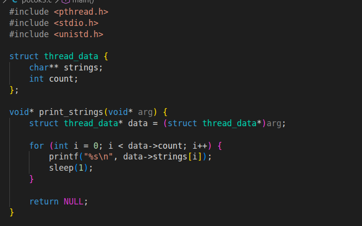
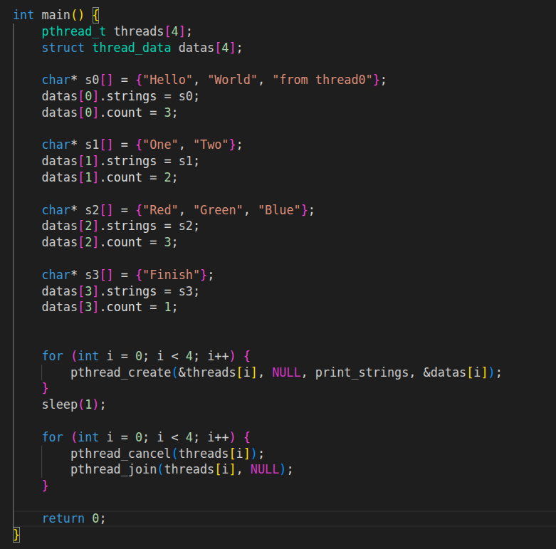
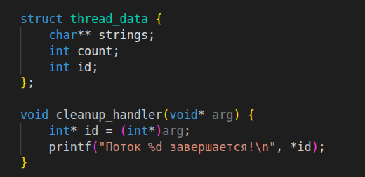
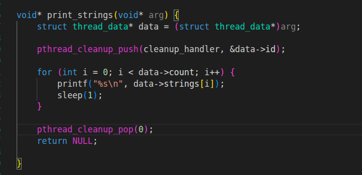
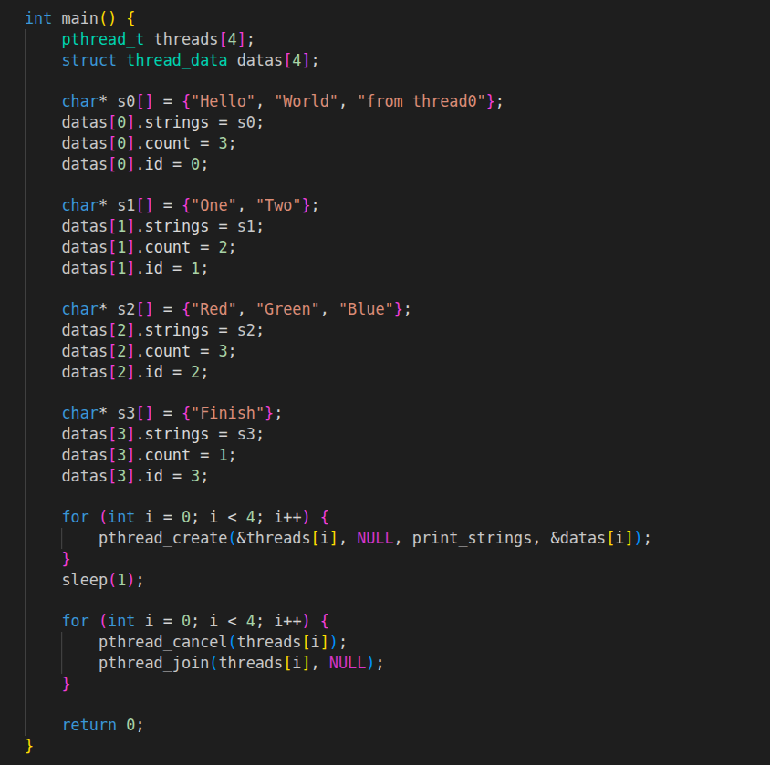

# На 3:
## 1 и 2 задание (создать поток и Ожидание потока)

Функция для дочерних потоков

Создание дочернего потока и правильный вывод обоих потоков
## 3 и 4 задание (Параметры потока и Завершение нити без ожидания)

Функция для дочерних потоков и структура для ввода разных данных в потоки

Создание потоков с прерывание до завершения
## 5 задание (Реализовать простой Sleepsort)

Добавил в структуру id для "Поток завершается" и также добавил функцию для вывода этой надписи

Добавил pthread_cleanup_push в функцию для потоков

Немного изменил main добавив id